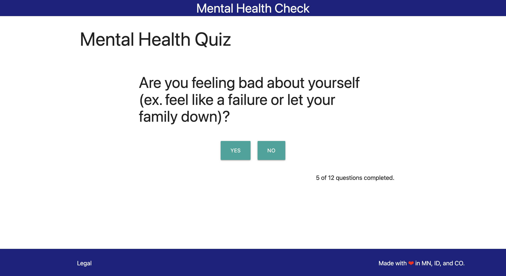
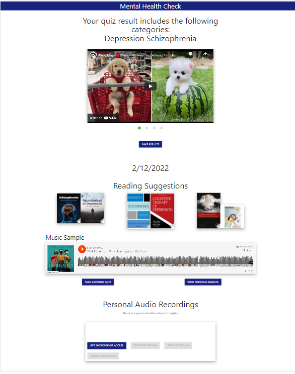

# Mental Health Check

A mental health quiz app addressing comorbidities in mental illness

https://nitrotap.github.io/mental-health-check/

## Overview

Mental Health Check is a quiz app that helps users identify their feelings and directs them to helpful resources.

## Features

- Put together your own quiz by selecting from multiple supported mental health categories
- Video, audio, and book suggestions based on the results from your quiz
- Science-backed questions create an approachable app to help identify your feelings and direct you to useful resources

## Made By:
[Nitrotap](https://github.com/nitrotap) - Kartik Jevaji   
[Harabushi](https://github.com/Harabushi) - Colby Harris   
[Meshtatsuo](https://github.com/Meshtatsuo) - Dominic Misasi   
[kakudiego](https://github.com/kakudiego) - Diego Kaku   

## Preview

#### Landing

#### Quiz

#### Quiz Results

