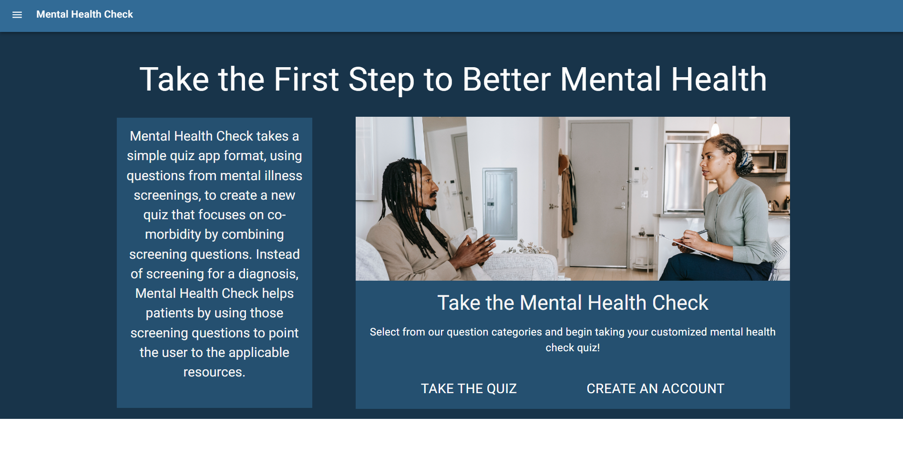
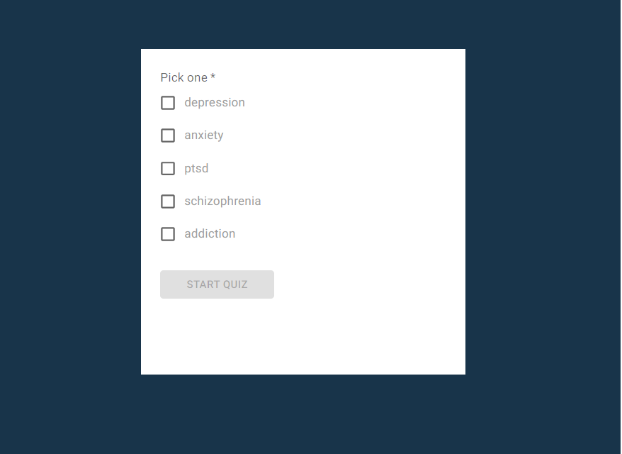
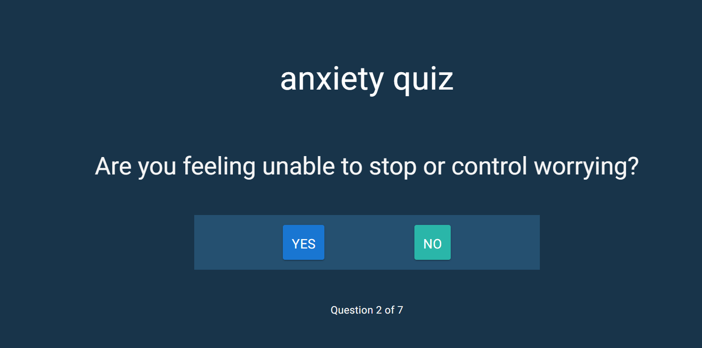
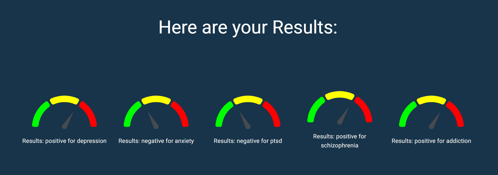

# Mental Health Check

## Description

A mental health quiz app that helps users track their moods using standardized screening tests. Mental Health Check tests users with multiple quiz options to help users understand and identify their feelings. The app is a Progressive Web Application including the ability to take and save quiz results offline. The application uses a React.js front-end with MongoDB and Express.js running the back-end and Node.js as the package manager.

  

  

https://mh-check.herokuapp.com/  
https://www.mhcheck.app/

## Table of Contents

- [Overview](#overview)
- [Features](#features)
- [Installation](#Installation)
- [Usage](#Usage)
- [Preview](#preview)
- [Made By](#made-by)
- [Questions](#Questions)
- [License](#License)

## Overview

Mental Health Check is a quiz app that helps users identify their feelings and directs them to helpful resources.

## Features

- Create an account to take your quiz today
- Science-backed questions create an approachable app to help identify your feelings and direct you to useful resources
- View previous quiz results by logging in

## Installation

Please install Node.js and MongoDB prior to installing the application.

[Node.js](https://nodejs.org/en/download)  
[MongoDB](https://www.mongodb.com/docs/manual/administration/install-community/)

Use the .env.example file to ensure proper database setup. Replace the environment variables with your MongoDB connection string.

`npm install`

## Usage

`npm run develop`

## Preview

#### Landing

#### Quiz

#### Quiz Results

## Made By:

[Nitrotap](https://github.com/nitrotap) - Kartik Jevaji  
[Harabushi](https://github.com/Harabushi) - Colby Harris  
[ChaVue91](https://github.com/chavue91) - Cha Vue  
[WillYazdani](https://github.com/WillYazdani) - Will Yazdani

## Questions

Please reach out to me on [GitHub](https://github.com/nitrotap) or by email at kartikinpublic@gmail.com for any additional questions.

## License

MIT

Copyright 2022 Kartik Jevaji
Permission is hereby granted, free of charge, to any person obtaining a copy of this software and associated documentation files (the "Software"), to deal in the Software without restriction, including without limitation the rights to use, copy, modify, merge, publish, distribute, sublicense, and/or sell copies of the Software, and to permit persons to whom the Software is furnished to do so, subject to the following conditions:

The above copyright notice and this permission notice shall be included in all copies or substantial portions of the Software.

THE SOFTWARE IS PROVIDED "AS IS", WITHOUT WARRANTY OF ANY KIND, EXPRESS OR IMPLIED, INCLUDING BUT NOT LIMITED TO THE WARRANTIES OF MERCHANTABILITY, FITNESS FOR A PARTICULAR PURPOSE AND NONINFRINGEMENT. IN NO EVENT SHALL THE AUTHORS OR COPYRIGHT HOLDERS BE LIABLE FOR ANY CLAIM, DAMAGES OR OTHER LIABILITY, WHETHER IN AN ACTION OF CONTRACT, TORT OR OTHERWISE, ARISING FROM, OUT OF OR IN CONNECTION WITH THE SOFTWARE OR THE USE OR OTHER DEALINGS IN THE SOFTWARE.

## Past contributors:

[Meshtatsuo](https://github.com/Meshtatsuo)  
[kakudiego](https://github.com/kakudiego)
